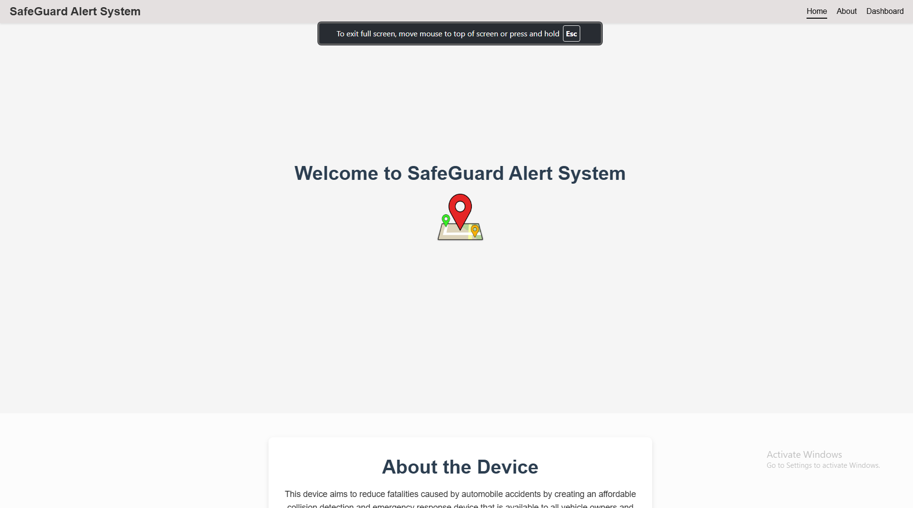

# SafeGuard-Alert System

SafeGuard Alert System is a vehicle safety solution designed to reduce fatalities caused by delayed emergency responses. The system detects vehicle collisions, sends automated SOS alerts via SMS and phone calls, and integrates GPS technology for real-time location reporting. It also allows authenticated users to manage emergency contact information via Firebase.

## Features
- **Collision Detection**: Reads impact data using an MPU6050 sensor.
- **Automated Alerts**: Sends SMS and initiates a call via SIM800L module upon detecting a collision.
- **GPS Integration**: Reports real-time vehicle location.
- **Firebase Integration**: Stores and retrieves emergency contacts securely.
- **User Authentication**: Allows only authenticated users to access and manage their contacts.

## Project Goals
The SafeGuard Alert System aims to:
- Improve emergency response times.
- Provide an affordable safety solution for all vehicles, including public transportation.
- Ensure inclusivity and accessibility of advanced safety features.

## Components
- **Arduino Nano RP2040 Connect** (with inbuilt ESP32 and Bluetooth)
- **SIM800L GSM Module**
- **GPS Module**
- **MPU6050 Accelerometer and Gyroscope**
- **Firebase** (Real-time Database)
- **LCD Display**
- **Relay Module**
- **Power Supply**

## How It Works
1. **Collision Detection**: The MPU6050 sensor detects impact data.
2. **Data Processing**: The Arduino processes the data to determine if a collision has occurred.
3. **Alert Mechanism**:
   - Sends an SOS SMS to emergency contacts.
   - Initiates a call to the first emergency contact.
4. **Location Reporting**: The GPS module fetches the vehicle's real-time location and includes it in the SMS.
5. **Contact Management**: Users can store, update, and delete emergency contacts through Firebase.

## System Workflow
1. **Initialization**: The system starts and initializes the sensors and modules.
2. **Collision Monitoring**: Continuously monitors impact data.
3. **Trigger Alert**: Sends alerts upon detecting a collision.
4. **User Interaction**: Users can manage their contacts via a web-based interface.

## Installation
### Hardware Setup
1. Connect the MPU6050 sensor to the Arduino.
2. Connect the SIM800L and GPS modules.
3. Set up the LCD display and relay module.
4. Power the system with a stable power supply.

### Software Setup
1. Install the necessary Arduino libraries:
   - `Wire.h`
   - `Adafruit_MPU6050.h`
   - `TinyGPSPlus.h`
   - `FirebaseESP32.h`
2. Upload the SafeGuard Alert System code to the Arduino Nano RP2040 Connect.
3. Configure Firebase authentication and database.

## Usage
1. Power on the SafeGuard Alert System.
2. Ensure the modules are connected and working.
3. Add emergency contacts via the Firebase web interface.
4. Test the system by simulating a collision.

## Future Improvements
- Integration with additional communication channels (e.g., email, push notifications).
- Enhanced impact analysis using machine learning.
- Expanded compatibility with other vehicle systems.

## Acknowledgments
- **Cape Peninsula University of Technology (CPUT)** for resources and support.
- **Community Contributors** for their valuable feedback.

## Contact
**Samkele Ndzululeka**  
Computer Engineering Graduate  
GitHub: [samkeleN](https://github.com/samkeleN)
